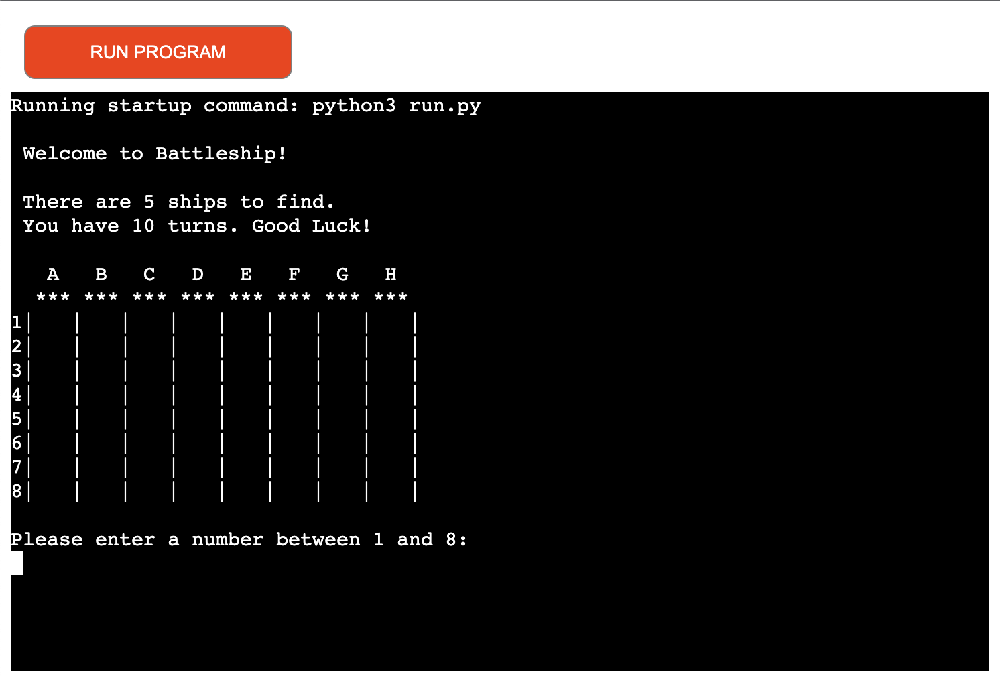

# Battleship

This is a Battleship game made in Python code.
It is deployed on Heroku platform together with nodejs package made på Code Institute. 
Go to https://sams-battleship-game.herokuapp.com/ to try it out. It is a web site with a mockup terminal. The game starts automatically.  When game is finished it can be restarted with the button "run program".

# Features
- Start screen will diplay board and instruction.
- Players first input is a number to choose row.
- Players second input is a letter to choose column.
- Player will then see a new board that shows if it is a hit or a miss.
- Player will do this after every round for 10 times.
- Player get information on how many rounds is remaining.
- When it is game over player will see a board showing all hits, misses and hidden ships.

## Features left to implement
- Bigger ships
- Player option to choose number of ships and number of rounds

# Bugs
- Corrected a bug when input was empty with a input check.
- Corrected a bug when input of letter was lowercase with .upper on input of letter.

# Testing
- Tested code through a P8P code checker with no errors
- Tested to put in a letter instead of a number. Player will get information it was wrong and a new input option.
- Tested to put in a number instead of a letter. Player will get information it was wrong and a new input option.
- Tested to press enter without any input. Player will get information it was wrong and a new input option.
- Tested with both uppercase and lowercase letter. Game will go on without any stop. 
- Tested to play 10 rounds without any stops or errors. Player will see the final board.

# Credits
**Example code and design is used from:**
- https://copyassignment.com/
- https://stackoverflow.com/
- https://datatofish.com/
- https://realpython.com/